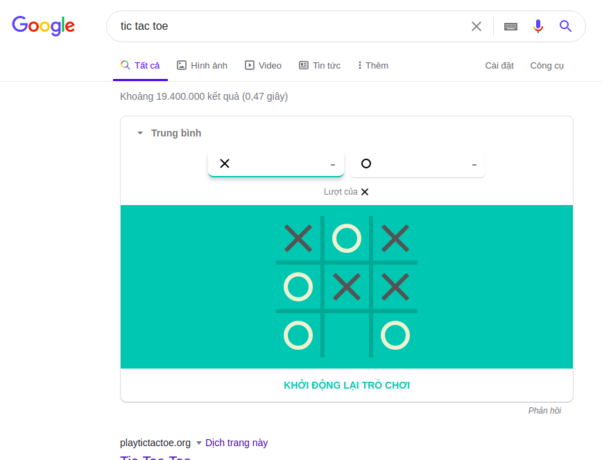

---

layout:  post

title:  Minimax algorithm with Golang

author:  Vu Hai Lam

---
# Minimax Algorithm
In my free time, I suddenly remembered an assignment in PRF192 subject (Programming Fundamentals with C/C++) when first year at my University. My teacher asked me to use Minimax Algorithm and code a classic game, Tic Tac Toe play with computer. By the way, I am studying new language, Go. So I choose it to code Tic Tac Toe again.
## The first, What is Minimax Algorithm
AI? Machine learning algorithm? No, It's just  a kind of backtracking algorithm that is used in decision making and game theory to find the optimal move for a player. In Minimax the two players are called maximizer and minimizer. The maximizer tries to get the highest score possible while the minimizer tries to do the opposite and get the lowest score possible. Let's see how it applies in Tic Tac Toe game.
## Tic Tac Toe Game
Tic Tac Toe is very classic. You can play it when you search Tic Tac Toe on Google.

For this scenario let us consider X as the maximizer and O as the minimizer. If X win, the value of this game status is 20. If O win, the value of this game status is -20. No one win, it is 0.

You can see above picture to imagine clearly. I found it on the internet.

Let's describe this picture!!

 - In the first state, It is X's turn. And X can choose one of that 3 ways.
 - The most right state is end. X win and return value of this state.
 - 2 remaining ones generate all way they can move with O turn and so on. If state end, return value of this state.
## Optimize: Depth
Let's see an example. Assume that there are 2 possible ways for X to win the game from a give board state: 
 - Move A : X can win in 2 moves
 - Move B : X can win in 4 moves
Of course, Move A is the best choice!! The number of move can be present by depth of Game tree. And the value of states change. If maximizer, substract depth value and minimizer, add depth value.
## In conclusion
Thank you for reading, You can find the code on [my github](https://github.com/VUHAILAM/minimax_go)
## References
 - https://www.geeksforgeeks.org/minimax-algorithm-in-game-theory-set-1-introduction/
 - [https://www.neverstopbuilding.com/blog/minimax](https://www.neverstopbuilding.com/blog/minimax)
 - [https://viblo.asia/p/thuat-toan-minimax-ai-trong-game-APqzeaVVzVe](https://viblo.asia/p/thuat-toan-minimax-ai-trong-game-APqzeaVVzVe))
